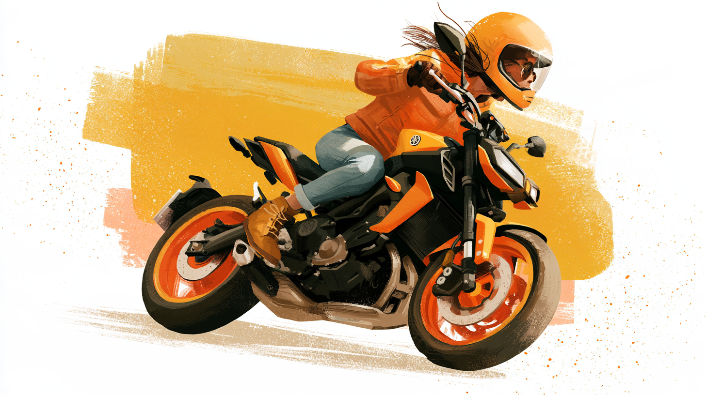
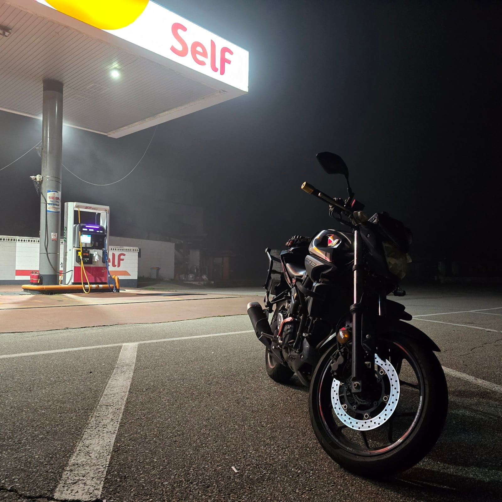

제가 바이크를 탄 지 어느덧 4년이 다 되어가고 있어요. 면허학원에서 몇 시간 동안 코스를 뺑뺑이 돌던 게 엊그제 같은데 이제는 전국 방방곡곡을 누비고 다녀요. 

***

처음에는 먼저 바이크를 타던 놋찌(저의 여친이랍니다\*^^\*)가 입문의 계기였어요. 재밌다고 입문시킨게 아니라... 같이 살던 집 근처가 주차난이 굉장히 심해서 바이크는 커녕 차 댈 곳도 마땅치 않았어요. 그래서 집에 가만히 있다 대뜸 불려나가서 차 옮겨주고 바이크도 옮겨주고 하던 날이 상당했답니다. 그렇게 어느 성가신 하루를 보낸 놋찌가 "나 바이크 접을까...?"라고 저한테 얘기하더라구요. 
그런데 예전부터 놋찌의 바이크 모험담을 계속 들어온 제 입장에서는 놋찌에겐 바이크 취미가 굉장히 소중하단 걸 알고 있었어요. 그래서 정말 접어버린다면 본인보다 제가 더 속상할 것 같은 느낌이 들어, 저는 이렇게 말합니다.

> **"나도 면허딸게! 같이 타자!"**

놋찌는 놀란 표정으로 되물었어요. "차 면허도 없는데?" 하지만 제 뜻은 꺾이지 않았어요. 놋찌의 제일 소중한 취미를 같이 할 수 있다면 그것만큼 기쁜 일은 없을 거에요. 

***

그렇게 근처의 운전면허학원의 2종 소형 과정에 등록했어요. 아시는 분은 아시겠지만 2종 소형의 난이도가 꽤나 높아요. 코스 자체는 짧은데 실격률이 높다고 해야 하나? 여튼 교과수업을 듣고 주말마다 나가서 3~4시간동안 장내코스를 계속 돌기만 했어요. 이건 학원마다 다르겠지만, 개중에는 코스마다 노하우를 알려주는 곳도 있다고 하더라구요? 저는 거의 방임식 교육이었거든요.
그래도 계속 하다보니 몸에 완전히 익히지는 못했지만 실패하는 회차보다 성공하는 회차가 늘기 시작했어요. 서서히 자신감이 붙기 시작했죠.

어느 **비오는** 주말 오전, 저는 귀에 버즈를 꽂고 이 노래를 틀었어요.

<바쿠온!>이라는, 그야말로 B급 개그 감성 가득한 **바이크 타는 여고생 애니**인데 오프닝 노래가 쓸데없이 좋아서 개인적으로 좋아해요. 이걸 들으며 면허시험장으로 향하는 길, 괜히 가슴이 설레더라구요. 여기서 합격하면 나도 바이크를 탈 수 있구나, 하면서요.

그리고 비오는 날씨에도 보기좋게 **합격**해버립니다! ~~탈선이 한 번 있었지만~~

***

교통공단에서 면허를 발급받고, 얼마 지나지 않아 모든 보호장비를 갖춘 저희는 둘이서 여행을 가기 위해 바이크를 대여해보기로 합니다. 그런데 면허를 딴 지 얼마 안 된 사람한테는 매뉴얼 바이크 렌트가 안되고, 대신 혼다 PCX(스쿠터)를 대여할 수 있다고 하더라구요? 이해는 가는데 납득이 되지 않는

일단 바이커들의 성지 **양평 만남의 광장**(이하 양만장)으로 향해보기로 합니다. 집에서부터 약 1시간 거리에 떨어져있어서 도로의 적응을 충분히 할 수 있는 거리였어요.
사실 제가 이 때 공도에 처음 나가본 순간이었어요. 교통법규는 알고 있었지만 실제 차들과 같은 도로를 달리는 건 처음이라 정말정말 떨렸어요. 내 바이크도 아닌데 이거 까지거나 넘어지거나 법 위반 하면 어떻하지... 하는 걱정이 산처럼 있었답니다. 되돌아 생각해보면 정말 간이 크다고밖에 생각이 안되네요. 몸으로 부딪히면서(진짜로 부딪히지는 않았습니다) 배우는 교통법규랄까

속도도 느리고 가속도 답답한 PCX를 타고 우여곡절 끝에 양만장에 도착한 저희는, 몬스터 한 캔 까면서 의자에 앉아 역사적인 이 순간을 음미하고 있었습니다. 그런데, 놋찌가 핸드폰을 보여주며 하는 말...

> **"속초 생각보다 가깝지 않아?"**

내비가 켜진 폰에는 2시간 30분이라는 시간이 찍혀있었고, 저희는 이미 도시를 빠져나온 상태라 편한 길만 가면 되는 상황이었습니다. 

어라...? 

왜 갈 만 하지?

저희는 바이크에 다시 시동을 걸었고, 장장 3시간을 달려 속초에 도착을 하게 됩니다. 이게 저희 애착코스인 속초와의 첫 만남이었네요. 이 때 묵었던 숙소가 단골이 되어 아직도 묵고 있어요.

***

그렇게 2종 소형 면허를 따고, 놋찌에게 바이크 선물도 받고, 전국 방방곡곡을 누비며 지금은 출퇴근도 바이크로 하고 있습니다. 회사 안에서도 유명인사더라구요. 더 추워지기 전에 바이크를 많이 타둬야 겠어요.

저의 세세라기쨩을 자랑하며 이만 줄이겠습니다...

아 바이크 타고 싶다