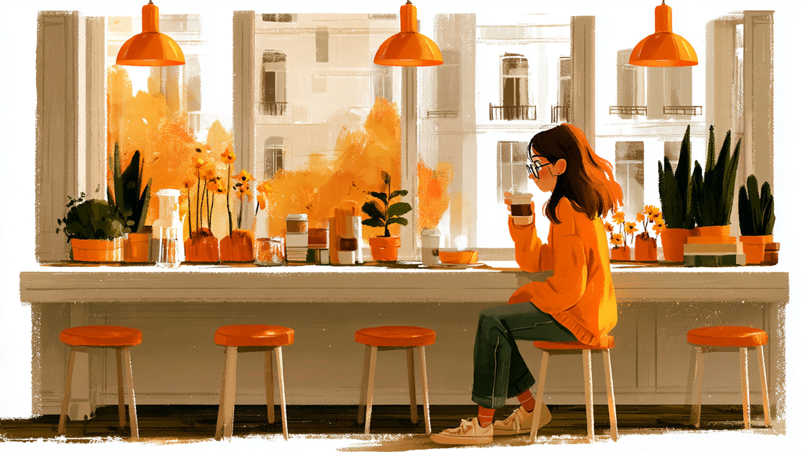

저는 블로그가 참 좋아요. 제 블로그는 처음에 마구 쓰려고 했다가 오래 가지 않아서 정전되긴 하지만, 그래도 인터넷 한 켠에 저만의 공간이 있다는 건 참 편안한 일이에요. 내 맘대로 글을 쓰고 내 맘대로 사진을 올리는 그런 작은 곳. 비단 누군가에게 보여지기 위해서 글을 쓰는 건 아니에요. 단지 제 마음가는 대로 키보드를 놀리며 이것저것 쌓아가는 곳이 되었으면 하는 마음에서 블로그를 운영하고 있어요.

그래서 프론트엔드 개발자로서 블로그라는 공간을 만드는 일도 좋아하는 편이에요. 고민을 들이면서 제 손을 타며 만들어진 블로그를 누군가가 써준다는 것 역시 꽤나 설레거든요. 

***

그러다보니 블로그를 여러 차례 만들고 나서 자꾸 마음에 안 드는 점이 한두군데 보이기 마련이더라구요. 아무래도 제 블로그니까 이렇게 여러번 뜯어고치고 할 수 있는게 아닐까 하긴 한데... 이번에 4번째더라구요. ㅋㅋㅋ 이 쯤 되면 디스트로호핑이 아니라 블로그호핑이 아닐지

이번에는 다른 때와 다르게 **Claude**를 활용해봤어요. 원래는 _'내 실력을 쌓기 위해 AI는 안 쓸거야!'_ 라는 주의였지만, 주변의 프론트 개발자들이 자기들은 이제 끝났다고 해서 도당체 어느정도길래 그러는건지 한 번 써봤어요. 완전히 바이브코딩은 아니고 수차례 리뷰를 하고 피드백을 하고 다시 고쳐쓰고 프롬프트를 쓰고 `AGENTS.md`에 쓰고... AI가 많이 좋아지기는 했지만 손이 가는 건 마찬가지네요.

그래도 이 정도 되는 블로그를 단 **이틀**만에 만들 수 있었어요. 디자인 초안은 클로드가 짜고 제가 수정하면서 코드로 옮기는 작업들이 꽤나 매끄럽게 이루어졌다고 말 할 수 있을 것 같아요. 대부분 디버깅이나 리뷰, 피드백이 작업 시간의 대부분을 차지했던 것 같아요.

***

사실 제 맘대로 블로그를 쓴다고는 했지만, 대강 어떤 느낌으로 굴려야겠다~ 하는 건 정해둬야 정전이 안되고 좀 꾸준히 쓸 수 있더라구요. 어느정도 컨셉이 있어야 저도 거기에 맞춰서 글감을 생각하거나 쓸 거리를 찾아다니게 되어요.

이번 블로그는 **일기장**으로 컨셉을 잡기로 했습니다. 그래서 좀 질리지 않게 계절마다 테마도 바꿀 여지를 많이 주고 꾸미는 요소를 많이 넣기도 했어요. 그리고 개발 일지도 어떻게 보면 일기장과 닮아 있잖아요? 개발 관련된 이야기도 놓치지 않고 쓸 거에요. 제가 한 것들은 최대한 이 블로그에 옮겨보려고 합니다.

시작해볼까요?